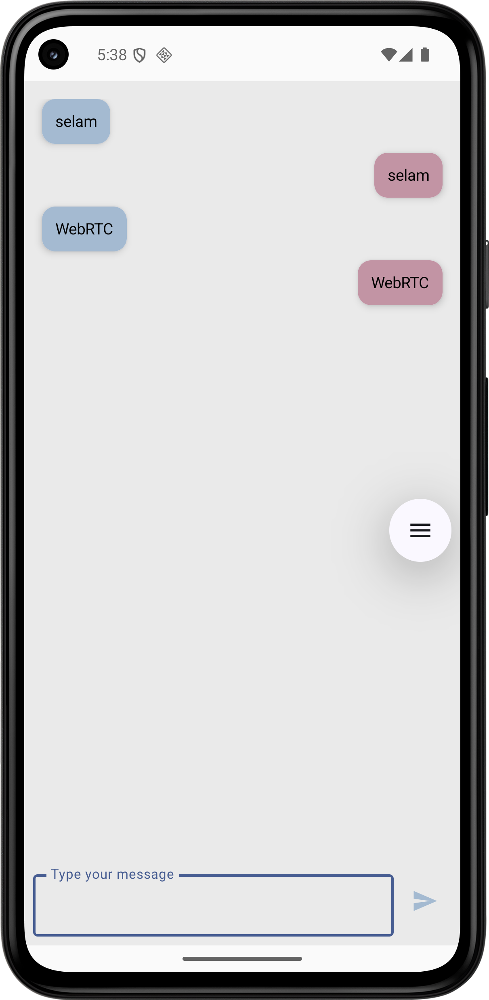

# WebRTC Android Application

This project is a modern Android application that combines real-time video calling and messaging features. It is developed using WebRTC technology and integrated with Firebase.

## 🚀 Features

- **Real-time Video Calling**: Peer-to-peer video calls using WebRTC technology
- **Messaging**: Real-time messaging with Firebase Realtime Database
- **Modern UI**: Modern user interface developed with Jetpack Compose
- **Dependency Injection**: Clean code architecture with Hilt
- **Material Design 3**: Current design standards

## 🛠️ Technologies Used

### Core Technologies
- **Kotlin** - Programming language
- **Android SDK** - Platform APIs
- **Jetpack Compose** - Modern UI framework
- **Material Design 3** - Design system

### WebRTC & Communication
- **WebRTC** (com.mesibo.api:webrtc:1.0.5) - Real-time communication
- **Firebase Realtime Database** - Real-time data synchronization
- **Firebase Analytics** - Usage analytics

### Architecture & Dependencies
- **Hilt** - Dependency injection
- **ViewModel** - UI state management
- **Gson** - JSON parsing
- **Compose Icons** - Icon libraries (Eva Icons, Feather)

### Build Tools
- **Gradle** - Build system
- **Android Gradle Plugin 8.11.0**
- **Kotlin 2.0.21**

## 📱 Screenshots

### Device 1 Chat Screen


### Device 2 Chat Screen


### Device 1 is in Looking For Match State


### Device 2 After Connection


## 🏗️ Project Structure

```
app/src/main/java/com/example/webrtc_android/
├── di/                    # Dependency injection
│   └── AppModule.kt
├── remote/               # Firebase client and data models
│   ├── FirebaseClient.kt
│   └── StatusDataModel.kt
├── ui/                   # UI components and screens
│   ├── components/
│   │   ├── ChatSection.kt
│   │   └── SurfaceViewRenderer.kt
│   ├── screens/
│   │   ├── CameraScreen.kt
│   │   └── ChatScreen.kt
│   ├── theme/
│   │   ├── Color.kt
│   │   ├── Theme.kt
│   │   └── Type.kt
│   └── viewmodel/
│       └── MainViewModel.kt
├── utils/                # Utility classes
│   ├── ChatItems.kt
│   ├── FirebaseFieldNames.kt
│   ├── MatchState.kt
│   ├── SharedPrefHelper.kt
│   ├── SignalDataModel.kt
│   └── ValueEventListener.kt
└── webrtc/              # WebRTC implementation
    ├── PeerObserver.kt
    ├── RTCAudioManager.kt
    ├── RTCClient.kt
    ├── RTCClientImpl.kt
    ├── SDPObserver.kt
    └── WebRTCFactory.kt
```

## 🚀 Installation

### Requirements
- Android Studio Hedgehog | 2023.1.1 or higher
- Android SDK 36
- Minimum SDK: 24 (Android 7.0)
- Target SDK: 36 (Android 14)

### Steps

1. **Clone the repository**
   ```bash
   git clone https://github.com/cevizenes/WebRTC-Android.git
   cd WebRTC-Android
   ```

2. **Firebase configuration**
   - Create a new project in Firebase Console
   - Add `google-services.json` file to the `app/` folder
   - Enable Realtime Database

3. **Build the project**
   ```bash
   ./gradlew build
   ```

4. **Run the application**
   ```bash
   ./gradlew installDebug
   ```

## 🔧 Configuration

### Firebase Setup
1. Create a project in Firebase Console
2. Add Android application
3. Download `google-services.json` file
4. Configure Realtime Database rules

### WebRTC Configuration
- You can configure necessary settings for STUN/TURN servers in `RTCClient.kt` file
- Firebase Realtime Database is used for signaling server

## 📋 Feature Details

### Video Calling
- Peer-to-peer connection
- Automatic camera/microphone management
- Screen sharing support
- Connection status indicator

### Messaging
- Real-time message sending
- Message status tracking
- Media sharing
- Read receipts

